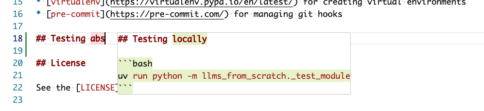

# Using the Cursor IDE


## Fixes & tips

### Increasing font sizes in Cursor chat & composer

I followed [these instructions](https://forum.cursor.com/t/changing-chat-panel-font-size-line-height-easily/375/7)

1. Installed the [APC Customize UI extension](https://marketplace.visualstudio.com/items?itemName=drcika.apc-extension)
2. Used the following `apc.stylesheet` settings:

    ```json
    "apc.stylesheet": {
        ".anysphere-markdown-container-root": "font-size: 16px !important; line-height: 1.5 !important;",
        ".view-line": "font-size: 16px !important;",
        ".aislash-editor-input": "font-size: 16px !important; line-height: 1.5 !important;"
    }
    ```

### Removing intrusive popup suggestions

Example of an intrusive popup suggestion:


Example of an unintrusive inline suggestion:

